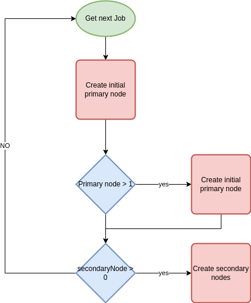
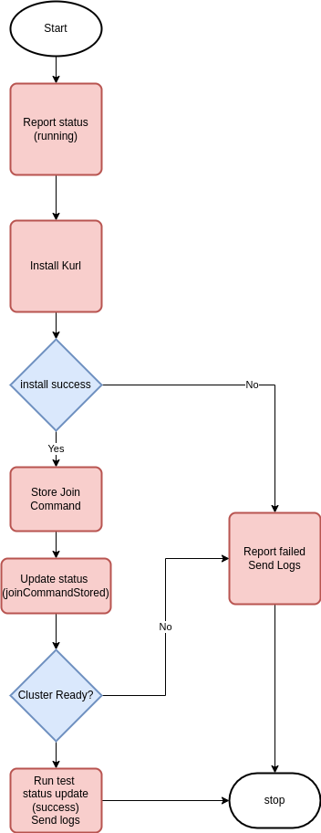
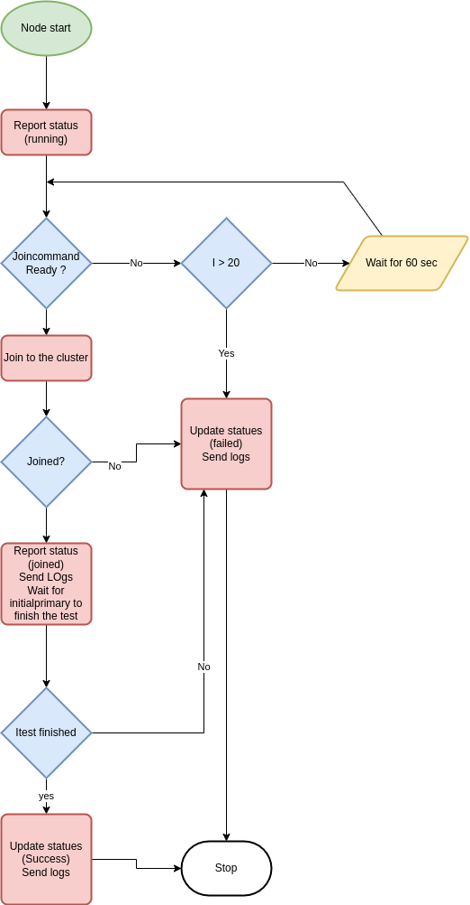

# Testgrid
Testgrid is a an automation testing platform for kURL.
Testgrid installs kURL specs on a set of linux os versions and runs conformance tests.
## Testgrid components and Architecture
- Testgrid has three main components.
   - TGAPI: API is the main player that store and retrive the data to and from the database
   - Web: is the web interface for tests
   - TGrun: a daemon that polls the api for queued runs and starts new vms and tests.


# Run Testgrid Locally
## Prerequests
- Have docker running locally
- Have some k8s cluster running
- Install [SchemaHero](https://schemahero.io/docs/installing/kubectl/)
- Install skaffold: https://skaffold.dev/docs/install/
- Set `GOOS` and `GOARCH`
```bash
   export GOOS=linux
   export GOARCH=amd64
```
## Run Testgride using skaffold
- Connect to the cluster
- Run the following command from ``TESTGRID`` path
```
make install
```

- Setup port-forwards
``` bash
kubectl port-forward svc/tgapi 30110:3000 &
kubectl port-forward svc/testgrid-web 30881:30881
```

- Now you are ready to do your first test. 

- From tgrun folder run the following command
```
./bin/tgrun queue --os-spec hack/os-spec.yaml --spec hack/test-spec.yaml --ref test-1 --api-token this-is-super-secret --api-endpoint http://localhost:30110
```

- From the web service you should be able to see the pending test.

- Now time to setup your runner by using ``terraform`` go indide the ``deploy` folder and follow the steps from the readme file.

# Run Testgrid on Okteto

1. Change directories to the root of the project
1. Run `okteto pipeline deploy -f testgrid/okteto-pipeline.yaml`
1. To "queue" a run `./bin/tgrun queue --os-spec hack/os-spec.yaml --spec hack/test-spec.yaml --ref ethan-1 --api-token this-is-super-secret --api-endpoint https://tgapi-${OKTETO_NAMESPACE}.replicated.okteto.dev`

# Support for multi node cluster

- TESTGRID is now supporting multi node cluster before it run the test
- You can achieve that by putting the following lines in specs file

```
  numPrimaryNodes: 1
  numSecondaryNodes: 1
```

- This will make the cluster run with one primary node and one secondary node. 

- The process will be divided into three stages
  
  1- Main process before the actual node run

  2- Initial primary node process

  3- Normal nodes process (other primary and secondary nodes)  

## Mainprocess

- The following chart explain what happens in the main process



## InitPrimary node

- The primary node can be in the following status

   1- ``running`` when the VMI start

   2- ``JoincommandStored`` when it does store the join command

   3- ``Success`` when the test run successfully 

   4- ``Failed`` when any steps during the test fail

- The following chart explain what happens in the initial primary node



## Other Nodes Flowchart

- Normal Nodes can be in the following status

   1- ``Running`` when the VMI strat

   2- ``WaitingJoinCommand`` when the waiting process start

   3- ``Joined`` When the node join successfully to the cluster

   4- ``Success`` when the test run successfully and the initial primary node finish the test

   5- ``failed`` when it fails to run any step
   
- The following chart explains what happens in the normal node (secondary and normal primary nodes)


