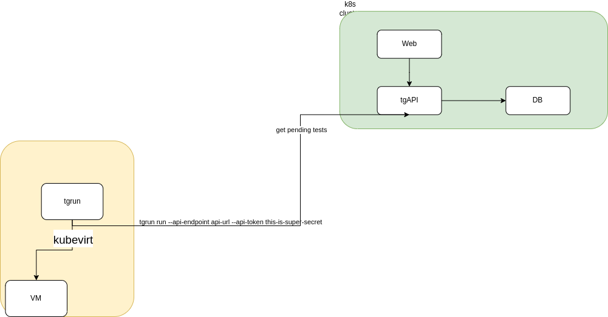

# Testgrid
Testgrid is a an automation testing platform for kURL.
Testgrid installs kURL specs on a set of linux os versions and runs conformance tests.
## Testgrid components and Architecture
- Testgrid has three main components.
   - TGAPI: API is the main player that store and retrive the data to and from the database
   - Web: is the web interface for tests
   - TGrun: a daemon that polls the api for queued runs and starts new vms and tests.


# Run Testgrid Locally
## Prerequests
- Have docker running locally
- Have some k8s cluster running
- Install [SchemaHero](https://schemahero.io/docs/installing/kubectl/)
- Set `GOOS` and `GOARCH`
```bash
   export GOOS=linux
   export GOARCH=amd64
```
## Run Testgride using skaffold

- Build tgapi: `(cd tgapi && make build)`

- Build tgrun: `(cd tgrun && make build)`

- Install skaffold: https://skaffold.dev/docs/install/

- From the TESTGRID folder run the following command
```bash
skaffold run --default-repo ttl.sh/yourname-testgrid
```
- This might take time

- Setup port-forwards
``` bash
kubectl port-forward svc/tgapi 30110:3000 &
kubectl port-forward svc/testgrid-web 30881:30881
```

- Now you are ready to do your first test. 

- From tgrun folder run the following command
```
./bin/tgrun queue --os-spec hack/os-spec.yaml --spec hack/test-spec.yaml --ref test-1 --api-token this-is-super-secret --api-endpoint http://localhost:30110
```

- From the web service you should be able to see the pending test.

- Now time to setup your runner by using ``terraform`` go indide the ``deploy` folder and follow the steps from the readme file.

# Run Testgrid on Okteto

1. Change directories to the root of the project
1. Run `okteto pipeline deploy -f testgrid/okteto-pipeline.yaml`
1. To "queue" a run `./bin/tgrun queue --os-spec hack/os-spec.yaml --spec hack/test-spec.yaml --ref ethan-1 --api-token this-is-super-secret --api-endpoint https://tgapi-${OKTETO_NAMESPACE}.replicated.okteto.dev`
